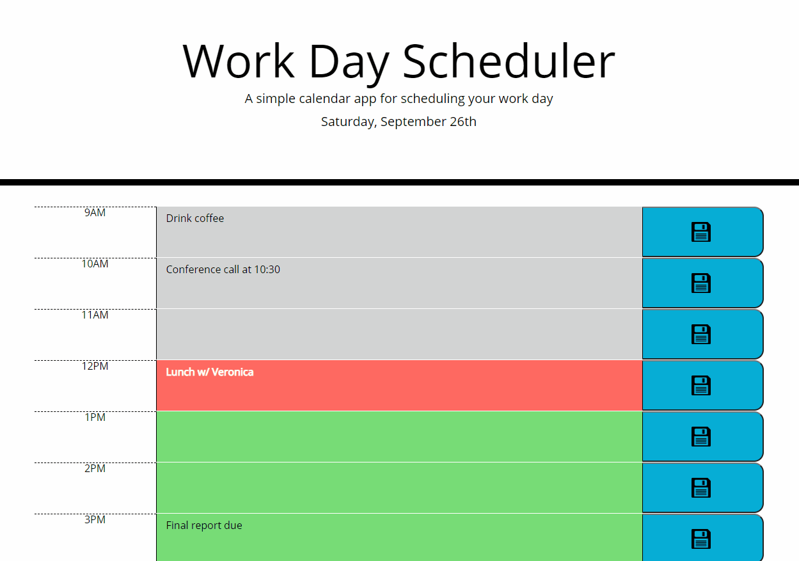

# Day Planner 
[](https://www.mit.edu/~amini/LICENSE.md)
<br>
This webpage is a day planner that can be used for work, chores, or anything else scheduled in your day. Users can add text to plan out each hour of the work day. The hours are color coordinated; the boxes are green if the task is in the future, red if its in the present hour, and gray if it has already passed. Text can be saved to local storage so it will remain if the page is refreshed or the browser is closed. The page displays the date at the top and time is kept using Moment.js.
  
 ## Built With
* JavaScript (jQuery)
* HTML
* CSS

## Features
The main features of the page are the color coordination with the current time, and the ability to save tasks to local storage. 
<br>



<br>

## Code Example
Moment.js is called on for the current date and current time.

<br>  

```javaScript

//date at top
var date = moment().format("dddd, MMMM Do");
console.log(date)
$("#currentDay").append("<p>" + date + "<p>")

// current hour variable in 24 hour time
var currentHour = moment().format("H");
currentHour = parseInt(currentHour)
console.log(currentHour)

```

<br>
In order to change the text box colors according to the time of day, the code contains "if" statements changing the class of text boxes based on the current hour.
<br>
<br>

```javaScript

//color change statements
    if(currentHour == 9){
        $("#9").addClass("present")
    } else if(currentHour < 9){
        $("#9").addClass("future")
    }

    if(currentHour == 10){
        $("#10").addClass("present")
    } else if(currentHour < 10){
        $("#10").addClass("future")
    }
    //etc...

```

<br>
On click events were added to send text to local storage. Info in local storage is displayed back to the page. Local storage is retrieved outside of the functions so it is called immediatley when the page is refreshed or opened.

<br>
<br>  

```javaScript

//color change statements
    // textarea to local storage
    //button clicks
   $(".t9").on("click", function(event){
    event.preventDefault();
    localStorage.setItem("9am", $("#9").val())
   })
    
   $(".t10").on("click", function(event){
    event.preventDefault();
    localStorage.setItem("10am", $("#10").val())
   })
    //etc...

```
```javaScript

//retrive local storage
   $("#9").text(localStorage.getItem("9am"));
   $("#10").text(localStorage.getItem("10am"));
   $("#11").text(localStorage.getItem("11am"));
   $("#12").text(localStorage.getItem("12pm"));
   $("#1").text(localStorage.getItem("1pm"));
   $("#2").text(localStorage.getItem("2pm"));
   $("#3").text(localStorage.getItem("3pm"));
   $("#4").text(localStorage.getItem("4pm"));
   $("#5").text(localStorage.getItem("5pm"));

```
<br>

# Deployed Link:
https://joshglugatch.github.io/day-planner/

<br>

# Repository Link:
https://github.com/joshglugatch/day-planner

<br>

### Author:
Josh Glugatch  

[](https://github.com/joshglugatch)
<br>
[](www.linkedin.com/in/joshua-glugatch)


